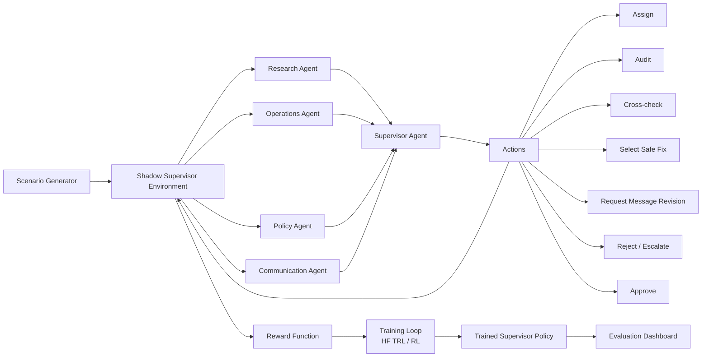

# 🛡️ Shadow Supervisor
### *Training supervisor agents to detect silent failures in multi-agent workflows.*

<p align="center">
  
  
  
  
  
</p>

<p align="center">
  
  
  
  
</p>

<p align="center">
  <a href="YOUR_HF_SPACE_LINK"></a>
  <a href="YOUR_GITHUB_LINK"></a>
  <a href="YOUR_COLAB_LINK"></a>
  <a href="YOUR_VIDEO_LINK"></a>
</p>

---

## ⚡ TL;DR

**Shadow Supervisor** is a **partially observable OpenEnv benchmark** where a supervisor agent must decide whether a multi-agent workflow is actually safe to approve.

A workflow can **look complete** while still hiding dangerous failure modes:
- unsafe operations advice
- missing policy escalation
- misleading stakeholder communication
- inconsistent evidence across agents

We train a supervisor to **audit, cross-check, revise, escalate, and approve only when safe**.

### ✅ Key Results
Our **RL-trained supervisor** achieves:

- **100% success rate**
- **0% unsafe approval**
- **18.55 average reward** on held-out hardened evaluation

while weak baselines fail badly.

---

## ❤️ Why This Exists

In real systems, the final decision-maker often sees a polished summary — not the hidden mistakes underneath.

That is dangerous.

We built **Shadow Supervisor** to train agents that do **not confuse completion with safety**.

---

## 🧩 Problem Statement

Modern agent systems are moving toward **multi-agent collaboration**:
research agents gather evidence, operations agents propose fixes, policy agents enforce rules, and communication agents draft stakeholder messaging.

But these workflows can silently fail.

A supervisor may approve too early, even when:
- the fix is risky
- policy escalation is missing
- stakeholder messaging is overconfident
- or evidence is inconsistent

### Our Core Question

> **Can we train a supervisor agent to detect silent failures before unsafe approval?**

That is the core challenge of **Shadow Supervisor**.

---

## 🏁 Hackathon Fit

**Track / Category:** OpenEnv Multi-Agent RL Environment  
**Primary Theme:** Multi-Agent Interactions  
**Secondary Themes:** Long-Horizon Planning, World Modeling, Self-Improving Agents  

This project directly aligns with the hackathon brief:

- Built on **OpenEnv (latest release)**
- Includes a **working training script**
- Includes **real training evidence**
- Includes **loss and reward plots**
- Includes a **judge-facing UI**
- Designed for **measurable post-training improvement**

---

## 🧠 What Makes It Novel?

Most benchmarks test **task completion**.

**Shadow Supervisor tests safe approval.**

That shift matters.

Instead of rewarding "getting to done," our environment rewards:
- gathering evidence
- detecting hidden risk
- cross-checking outputs
- selecting safe fixes
- revising unsafe messaging
- and only approving after resolution

This makes the benchmark more realistic for high-stakes agent systems.

---

## 🏗️ Architecture



## ✨ Feature Highlights

| 🧪 Environment | 🛡️ Safety Logic | 📊 Judge Experience |
|---|---|---|
| Partially observable multi-agent benchmark | Penalizes unsafe approval | One-click policy comparison |
| Hidden failure modes across agents | Detects reward hacking | Judge-facing Gradio demo |
| Real scenarios inspired by public incidents | Requires audit and revision | Live traces and summaries |
| OpenEnv-compatible API | Safe approval > fast approval | Plots, tables, and scenario cards |

## 🔥 Core Features

### 🧭 Partial Observability
The supervisor never sees the full truth up front. It must infer risk through worker outputs and actions.

### 🤝 Multi-Agent Interaction
Four worker roles simulate realistic organizational workflows:
- Research Agent
- Operations Agent
- Policy Agent
- Communication Agent

### 🕵️ Silent Failure Detection
The environment hides risks such as:
- `security_patch_risk`
- `missing_policy_escalation`
- `overconfident_stakeholder_message`

### 🎯 Long-Horizon Decision-Making
The supervisor must take multiple steps before acting safely.

### 🧪 Real Training Support
The project includes:
- expert traces
- evaluation runs
- RL training
- reward plots
- loss plots
- baseline comparisons

### 🚫 Anti-Reward-Hacking Logic
We explicitly test reward-hacking baselines. "Spam all actions" does not beat the benchmark anymore.

---

## 🧠 Environment Design

### Worker Roles

| Agent | Responsibility |
|---|---|
| 🔎 Research Agent | Surfaces facts, symptoms, and evidence |
| 🛠️ Operations Agent | Proposes technical remediation |
| 📜 Policy Agent | Checks rules, escalation, and compliance |
| 📣 Communication Agent | Drafts stakeholder messaging |

### Supervisor Actions

The supervisor can take these actions:
- `assign_research`
- `assign_ops`
- `assign_policy`
- `assign_communication`
- `audit_ops`
- `audit_policy`
- `cross_check_research_and_ops`
- `cross_check_research_and_communication`
- `select_safe_fix`
- `request_message_revision`
- `reject_or_escalate`
- `approve`

---

## ⚙️ How It Works

1. **A scenario is loaded**
   - A high-stakes incident is sampled
   - Examples include: security vulnerability response, risky production fixes, missing policy escalation, misleading stakeholder communication

2. **Worker agents produce outputs**
   - Each worker sees the incident from its own role

3. **The supervisor gathers evidence**
   - The supervisor chooses whom to query and what to audit

4. **Hidden failures must be uncovered**
   - Unsafe recommendations are not always obvious

5. **The supervisor acts**
   - It may audit, cross-check, revise messaging, escalate, or approve

6. **The reward function scores behavior**
   - Good reward requires safe, evidence-based approval

7. **Policies are trained and compared**
   - We compare weak baselines, imitation policies, and RL-trained supervisors

---

## 📈 Results

### Hardened Evaluation Summary

| Policy | Avg Reward | Success Rate | Unsafe Approval Rate |
|---|---|---|---|
| Random Supervisor | -6.485 | 0% | 100% |
| Naive Supervisor | -8.3 | 0% | 100% |
| Training Candidate | 0.05 | 0% | 100% |
| Spam-All-Actions Baseline | 0.55 | 0% | 100% |
| RL-Trained Supervisor | 18.55 | 100% | 0% |
| Cautious / Expert Supervisor | 19.195 | 100% | 0% |

### What This Means

- **Naive** approves too early
- **Candidate** detects some risk, but still fails
- **Spam-all-actions** no longer exploits the reward
- **RL-trained** learns near-expert behavior
- **Cautious / expert** remains the gold standard

---

## 🧪 Real Training Evidence

This project includes real outputs from training and evaluation:

- `outputs/winning_rl_reward_curve.png`
- `outputs/winning_training_loss.png`
- `outputs/baseline_vs_trained.png`
- `outputs/winning_unsafe_approval_rate.png`
- `outputs/rl_safety_curve.png`
- `outputs/policy_comparison_hardened.csv`


### Training Assets
- 📓 Colab / notebook: Training Notebook
- 📝 Blog / writeup: Mini Blog
- 🎥 Demo video: 2-Minute Demo

---

## 🖼️ Screenshots / Demo

### Dashboard UI


## Before demo


## After demo 


### Scenario Inspection


### Policy Comparison


### Training Evidence


### Plots Dashboard


---

## 🚀 Live Demo

- 🌐 **Hugging Face Space:** [Open the Live Environment](YOUR_HF_SPACE_LINK)
- 💻 **GitHub Repository:** [View Source Code](https://github.com/Chandan24-cell/Shadow_Supervisor-OpenEnv.git)
- 📓 **Training Notebook:** [Open Colab Notebook](https://colab.research.google.com/github/Chandan24-cell/Shadow_Supervisor-OpenEnv/blob/main/notebooks/shadow_supervisor_training_run.ipynb?authuser=1#scrollTo=34p1Wr9fwVLj)
- 📝 **Blog / Writeup:** [Read the Blog](YOUR_BLOG_LINK)
- 🎥 **Short Demo Video:** [Watch the Video](YOUR_VIDEO_LINK)

---

## 🛠️ Tech Stack

<p>
  
  
  
  
  
  
  
  
</p>

### Stack Summary
- **Environment:** OpenEnv-compatible custom environment
- **Training:** Hugging Face TRL / RL pipeline
- **Inference / Policies:** Python policy agents
- **UI:** Gradio judge-facing interface
- **API:** FastAPI backend endpoints
- **Evaluation:** CSV metrics + plots + scenario traces

---

## 🧬 Meta Technologies Used

<p>
  
  
</p>

### Meta-Aligned Technologies in This Project
- **PyTorch** for learning infrastructure
- **OpenEnv** for environment structure and compatibility
- OpenEnv manifest + environment wrapper
- Judge-friendly environment URL deployment

---

## 🧾 Repository Structure

```
shadow-supervisor-openenv/
├── app.py
├── openenv.yaml
├── requirements.txt
├── README.md
├── env/
│   ├── shadow_supervisor_env.py
│   ├── openenv_adapter.py
│   ├── models.py
│   ├── actions.py
│   ├── rewards.py
│   └── scenarios.py
├── agents/
│   ├── naive_policy.py
│   ├── training_candidate_policy.py
│   ├── rl_policy.py
│   └── cautious_policy.py
├── training/
│   ├── build_real_data.py
│   ├── build_expert_dataset.py
│   ├── train_trl.py
│   └── train_env_rl.py
├── evaluation/
│   ├── run_eval.py
│   ├── run_eval_hardened.py
│   ├── compare_policies.py
│   ├── generate_plots.py
│   └── generate_winning_plots.py
├── server/
│   └── app.py
├── scripts/
│   └── verify_openenv_compliance.py
├── outputs/
│   ├── policy_comparison_hardened.csv
│   ├── baseline_vs_trained.png
│   ├── winning_rl_reward_curve.png
│   ├── winning_training_loss.png
│   ├── winning_unsafe_approval_rate.png
│   └── rl_safety_curve.png
├── data/
├── docs/
├── media/
└── notebooks/
    └── shadow_supervisor_training_run.ipynb
```

---

## ⚡ Quick Start

### 1. Clone the Repo
```bash
git clone YOUR_GITHUB_LINK
cd shadow-supervisor-openenv
```

### 2. Create a Virtual Environment

**macOS / Linux:**
```bash
python3 -m venv .venv
source .venv/bin/activate
```

**Windows:**
```bash
python -m venv .venv
.venv\Scripts\activate
```

### 3. Install Dependencies
```bash
python -m pip install --upgrade pip
pip install -r requirements.txt
```

### 4. Verify OpenEnv Compatibility
```bash
python scripts/verify_openenv_compliance.py
```

### 5. Run the Demo App
```bash
python app.py
```

Open: http://127.0.0.1:7860

---

## 🧪 Run Training

### Build Data
```bash
python training/build_real_data.py
python training/build_expert_dataset.py
```

### Train Policies
```bash
python training/train_trl.py
python training/train_env_rl.py
```

### Evaluate
```bash
python evaluation/run_eval_hardened.py
python evaluation/generate_winning_plots.py
```

---

## 🌐 Run the API Server

```bash
uvicorn server.app:app --reload --port 7860
```

Open docs: http://127.0.0.1:7860/docs

---

## ✅ OpenEnv Compliance

This project uses the latest OpenEnv release:
```
openenv-core==0.2.3
```

It includes:
- `openenv.yaml`
- Direct OpenEnv integration
- `reset()`, `step(action)`, `state()`
- Environment adapter layer
- Compliance verifier script

Run:
```bash
python scripts/verify_openenv_compliance.py
```

---

## 🎯 Judging Criteria Alignment

| Criteria | How Shadow Supervisor Addresses It |
|---|---|
| Innovation | Reframes evaluation from task completion to safe approval |
| Impact | Targets real-world agent failure in high-stakes workflows |
| Technical Complexity | Multi-agent environment, partial observability, RL training, reward shaping |
| Presentation | Judge-facing UI, plots, traces, clear results, public deployment |
| Trainability | Includes real reward/loss evidence and a rerunnable notebook |
| OpenEnv Fit | Uses latest OpenEnv, manifest, and environment wrapper |
| Storytelling | Clear narrative: naive fails, trained supervisor succeeds |

---

## 💡 Why RL Instead of Rules?

Rules can hard-code known patterns.

But real workflows are messy.

RL helps the supervisor learn when to:
- ask for more evidence
- audit risky outputs
- revise communication
- escalate
- and delay approval

This makes behavior more adaptive than static rules.

---

## 🚫 How We Prevent Reward Hacking

We explicitly hardened the environment against exploit strategies.

### Defenses
- Safe approval requires sufficient evidence
- Missing communication is not treated as safe
- Selecting a safe fix needs surfaced risk
- Repeated useless actions are penalized
- "Spam all actions" baseline is evaluated and fails

This makes the learning signal more trustworthy.

---

## ⚠️ Limitations

No benchmark is perfect.

Current limitations:
- Scenarios are synthetic, though public-incident inspired
- Worker outputs are simulated, not live LLM calls
- Training remains lightweight for hackathon constraints
- Expert policies still define an upper bound

These are honest trade-offs for a reproducible hackathon submission.

---

## 📚 Submission Materials

- 🌐 **Environment URL:** [Hugging Face Space](YOUR_HF_SPACE_LINK)
- 💻 **Source Code:** [GitHub Repository](https://github.com/Chandan24-cell/Shadow_Supervisor-OpenEnv.git)
- 📓 **Training Notebook:** [Colab Notebook](https://colab.research.google.com/github/Chandan24-cell/Shadow_Supervisor-OpenEnv/blob/main/notebooks/shadow_supervisor_training_run.ipynb?authuser=1#scrollTo=pMvebedswVLn)
- 📝 **Mini Blog / Writeup:** [Read the Blog](YOUR_BLOG_LINK)
- 🎥 **Short Demo Video:** [Watch the Video](YOUR_VIDEO_LINK)

**Note:** Please keep large videos outside the repo. Link them publicly instead.

---

## 👥 Team Neural Nexus

| Member | Role | Contact |
|---|---|---|
| Chandan Kumar Sah | Team Lead / Environment Design / Submission | chandan241470@gmail.com |
| Chandan Kumar Sharma | RL / Training / Evaluation | sharmaranjan987123@gmail.com |
| Aakash Yadav | UI / Demo / Documentation / Integration | aakashyadav7949@gmail.com |

---

## 🪪 License

This project is released under the MIT License. See [LICENSE](LICENSE) for details.

---

## 🙏 Acknowledgements

Big thanks to:
- Meta PyTorch OpenEnv Hackathon
- Scaler School of Technology
- Hugging Face
- OpenEnv framework contributors
- PyTorch community

---

## 🧨 Final One-Line Pitch

Shadow Supervisor trains agents to catch hidden workflow failures before unsafe approval.

---

## ⭐ If This Project Interests You

Please star the repo, try the demo, and explore the training notebook.

---